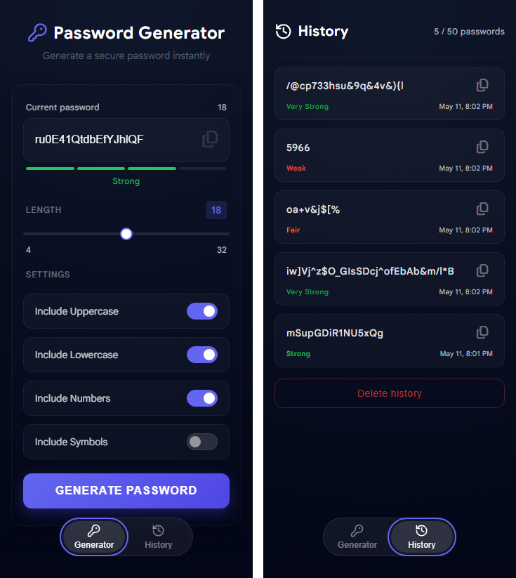
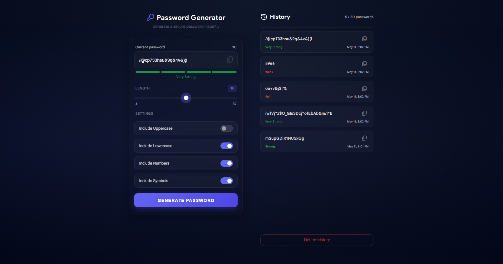

# Password Generator

Generador de contraseñas seguro y accesible construido con JavaScript vanilla, HTML y CSS. Diseñado como una single-page application mobile-first con adaptación completa a desktop.




---

## Funcionalidades

### Generator
- Longitud de contraseña configurable mediante slider personalizado (4–32 caracteres)
- Cuatro tipos de caracteres: mayúsculas, minúsculas, números y símbolos
- Strength indicator en tiempo real con cuatro niveles: Weak, Fair, Strong y Very Strong
- Copia al portapapeles con un click y feedback visual
- Botón Generate deshabilitado hasta que al menos un tipo de caracter esté seleccionado

### History
- Almacena hasta 50 contraseñas generadas con su nivel de fortaleza y timestamp
- Rotación automática: al alcanzar el límite, la entrada más antigua es reemplazada
- Contador dinámico con estado de advertencia al llegar al límite (50 / 50)
- Copia de cualquier contraseña directamente desde el historial
- Modal de confirmación antes de eliminar el historial
- Persistencia con `localStorage` — el historial sobrevive recargas de página

### Responsive layout
- Mobile: layout de una columna con tab bar para navegar entre las vistas Generator e History
- Desktop (≥ 1024px): layout de dos columnas con ambas vistas visibles simultáneamente
- Detección de viewport en tiempo real — se adapta al redimensionar la ventana sin recargar

---

## Aspectos técnicos destacados

**Arquitectura modular** — el código está dividido en ES Modules enfocados, cada uno con una única responsabilidad:

```
js/
├── app.js                 Entry point — solo inicialización
├── ui.js                  Referencias al DOM centralizadas
├── generate-password.js   Lógica de generación, slider, estado del botón
├── strength-indicator.js  Cálculo de fortaleza y actualización de la UI
├── copy-password.js       Clipboard API y feedback de copia
├── history.js             Storage, renderizado, eliminación y copia
├── navigation.js          Cambio de vistas y detección de viewport
└── utils.js               Utilidades compartidas (toast notification)
```

**Event delegation** — un único listener en la lista del historial maneja los clicks de copia de todos los ítems generados dinámicamente mediante `event.target.closest()`.

**Sincronización de viewport** — `window.matchMedia()` utiliza el mismo breakpoint que el CSS (`1024px`), manteniendo sincronizados el comportamiento de JavaScript y la hoja de estilos. Escucha cambios de viewport en tiempo real.

**Conversión de tipos explícita** — todos los valores de inputs del DOM se convierten con `parseInt(..., 10)` antes de usarse, evitando la coerción implícita (implicit coercion).

**Sin dependencias externas** — construido íntegramente con JavaScript vanilla, HTML y CSS. Sin frameworks, sin librerías, sin build tools.

---

## Accesibilidad

- Navegación completa por teclado
- Focus trap dentro del modal de confirmación de eliminación
- Modal cerrable con la tecla `Escape`
- Atributos ARIA en todos los elementos interactivos
- Contraste de color que cumple el estándar WCAG AA
- Respeto a `prefers-reduced-motion` para usuarios que prefieren animaciones reducidas
- Indicadores de foco visibles en todos los elementos interactivos

---

## Nota de seguridad

El historial de contraseñas se almacena en `localStorage` para persistencia entre sesiones. Esto es apropiado para una herramienta client-side que genera contraseñas para usar en otro lugar, pero `localStorage` no es adecuado para almacenar credenciales sensibles en aplicaciones de producción — es accesible para cualquier script que corra en el mismo origen y, por lo tanto, es vulnerable a ataques XSS (Cross-Site Scripting).

---

## Cómo ejecutarlo

No requiere instalación ni build step.

```bash
git clone https://github.com/Matias-abh/password-generator.git
cd password-generator
```

Abrir `index.html` directamente en tu navegador, o servirlo localmente:

```bash
npx serve .
```

> **Nota:** La Clipboard API (`navigator.clipboard`) requiere un contexto seguro (HTTPS o localhost). La función de copia no funcionará al abrir el archivo directamente vía `file://` en algunos navegadores.

---

## Qué aprendizajes reforcé

Este proyecto fue construido como un ejercicio de aprendizaje deliberado, enfocado en escribir JavaScript de calidad profesional — no solo en hacer que las cosas funcionen, sino en entender por qué cada decisión fue tomada.

Áreas clave practicadas:
- Arquitectura modular con ES Modules (`import`/`export`)
- Manipulación del DOM y patrones de event delegation
- JavaScript asíncrono con `async/await` y la Clipboard API
- `localStorage` para persistencia de datos client-side
- Diseño responsive con `matchMedia` para sincronización entre JavaScript y CSS
- Fundamentos de accesibilidad: ARIA, gestión del foco, navegación por teclado

---

## Licencia

MIT